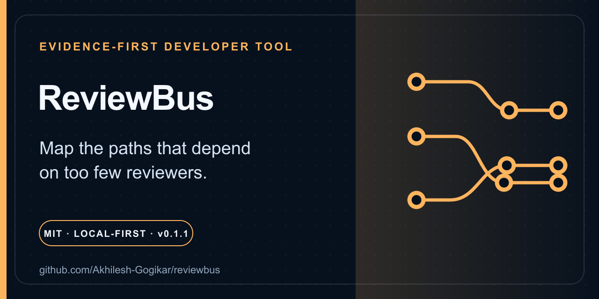

# ReviewBus

[](https://github.com/Akhilesh-Gogikar/reviewbus/actions/workflows/ci.yml)
[](LICENSE)



**Contributor count is not review coverage. Map the paths that depend on too few reviewers.**

ReviewBus turns public pull-request files and submitted reviews into reproducible path ↔ reviewer maps, concentration metrics, unowned-path evidence, and correction-friendly suggestions.

**Status:** 0.1.1 alpha. Source installation is supported; no package registry publication has occurred. Historical public activity is not formal ownership, current availability, employment, expertise, or performance.

## Why ReviewBus

- **Offline first:** analyze an inspectable JSON snapshot without a network request; optional fetching is separate and public-only.
- **Paths, not vanity counts:** review events are connected to changed files so bottlenecks stay visible at the subsystem boundary.
- **Correctable output:** JSON explains the metric and CODEOWNERS text is explicitly a suggestion, never an assignment.
- **Responsible by design:** no private repositories, employee score, location inference, automatic assignment, or governance action.

## Copy-paste demo

```sh
git clone https://github.com/Akhilesh-Gogikar/reviewbus.git
cd reviewbus
python3 -m venv .venv
. .venv/bin/activate
python -m pip install .
reviewbus analyze --input examples/public_repo.json --json /tmp/reviewbus.json --html /tmp/reviewbus.html --codeowners /tmp/CODEOWNERS.suggested
```

Expected: exit 0, three paths, two reviewers, one unowned path, plus nonempty JSON, HTML, and CODEOWNERS suggestions. On Windows PowerShell, activate with `.venv\Scripts\Activate.ps1` and replace `/tmp/...` with a local path.

## Optional public fetch

```sh
# GITHUB_TOKEN is optional; when used, give it read-only public access.
reviewbus fetch owner/repository --limit 25 --output /tmp/public-snapshot.json
reviewbus analyze --input /tmp/public-snapshot.json --json /tmp/reviewbus.json --html /tmp/reviewbus.html
```

`fetch` rejects repositories reported as private. It reads the optional token from `GITHUB_TOKEN` (or the variable selected by `--token-env`) and never writes the token to an artifact. Fetching is bounded to one page of at most 100 items per endpoint.

## What 0.1 measures

- the latest qualifying `APPROVED` or `CHANGES_REQUESTED` review by a non-author, attributed to each changed path;
- the minimum reviewers accounting for 80% of qualifying path-review events;
- reviewer/path counts, average response time from pull-request creation, and UTC activity span;
- paths with no qualifying event in the sample; and
- deterministic top-two reviewer and CODEOWNERS suggestions.

## Help shape 0.2

Useful contributions make the sample easier to inspect, correct, or reproduce—not more judgmental. Start with the five code-aware [issue seeds](docs/ISSUE_SEEDS.md), then read [CONTRIBUTING.md](CONTRIBUTING.md). A focused fixture, metric, fetch, or accessibility improvement is welcome.

## Install and support

ReviewBus supports Python 3.10–3.14 and has no runtime dependencies. CI tests every supported Python version on Linux and Python 3.14 on macOS and Windows.

- Questions and metric corrections: [support](SUPPORT.md) and [troubleshooting](docs/TROUBLESHOOTING.md)
- Vulnerabilities, tokens, or sensitive person data: [private security reporting](SECURITY.md)
- Compatibility: [API stability](docs/API_STABILITY.md) and [changelog](CHANGELOG.md)

## Project navigation

- Design: [architecture](docs/ARCHITECTURE.md), [privacy](docs/PRIVACY.md), and [accessibility](docs/ACCESSIBILITY.md)
- Direction: [roadmap](ROADMAP.md) and [governance](GOVERNANCE.md)
- Participate: [contributing](CONTRIBUTING.md), [code of conduct](CODE_OF_CONDUCT.md), and [issue seeds](docs/ISSUE_SEEDS.md)
- Boundaries: [scope](SCOPE.md), [provenance](PROVENANCE.md), and [optional ecosystem](ECOSYSTEM.md)

## Test

```sh
python3 -m unittest discover -s tests -v
```

## Honest limitations and non-goals

One qualifying review is attributed to every changed path, so large pull requests carry more path events. 0.1 does not model renames, teams, branch protection, review dismissal, merge authority, or complete pagination. UTC activity is not a location inference. “Unowned” means only that the analyzed sample has no qualifying event.

Do not use ReviewBus for employee ranking, maintainer shaming, automatic assignment, issue closure, or governance decisions. Private repositories are out of scope.

Released under the [MIT License](LICENSE).
